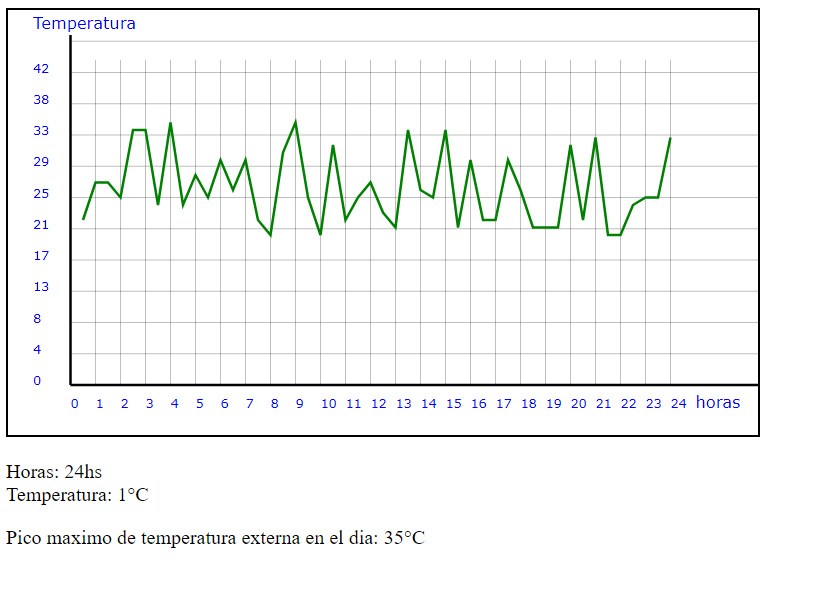

<h1>Código que muestra valores de temperatura diarios</h1>

Este pequeño módulo sirve para mostrar una gráfica cartesiana con valores de temperatura ingresados por hora. Se debe hacer una db con campo los campos de temperatura y horario

